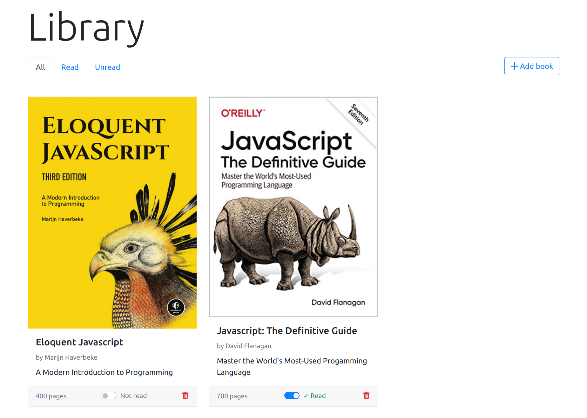
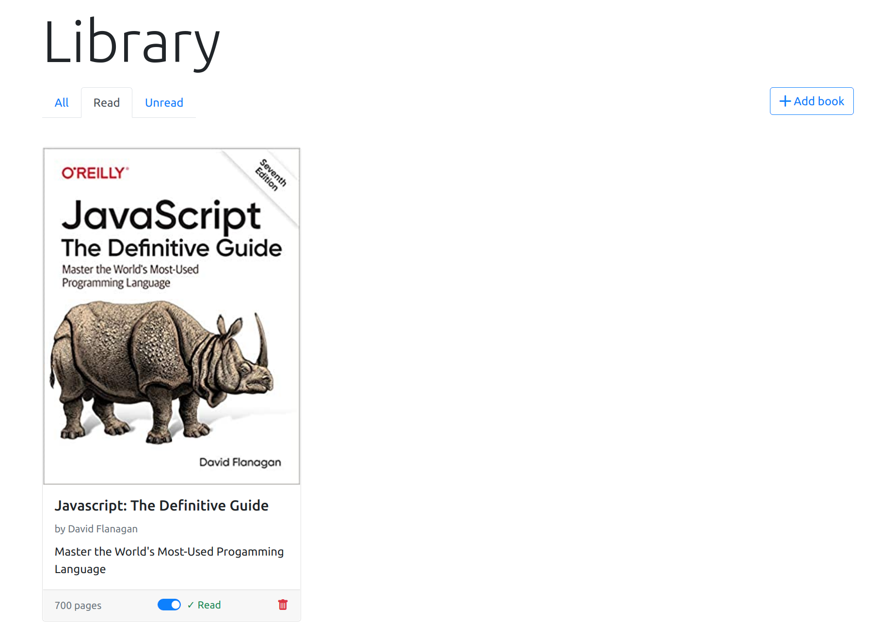
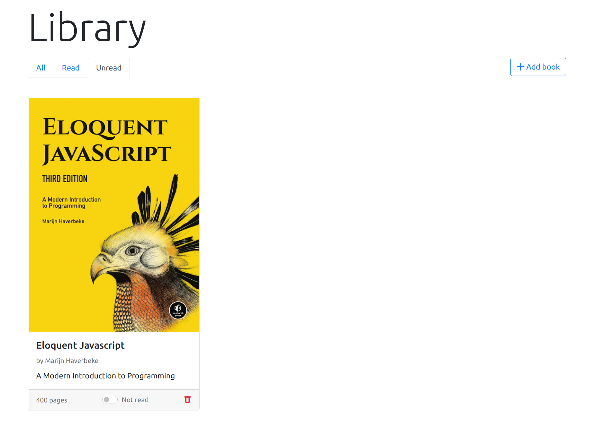
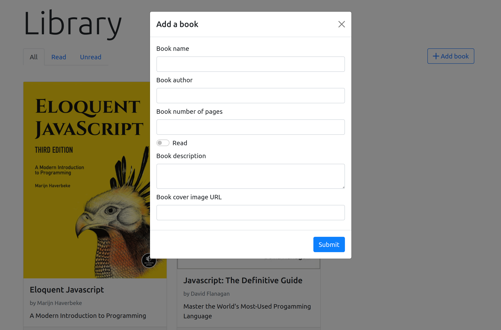

# library

This project is part of [The Odin Project's Foundation Course](https://www.theodinproject.com/paths/full-stack-javascript/courses/javascript/lessons/library).
It is a small books library application that lets you keep track of the books
that you are currently reading or have already read.

## screenshots

